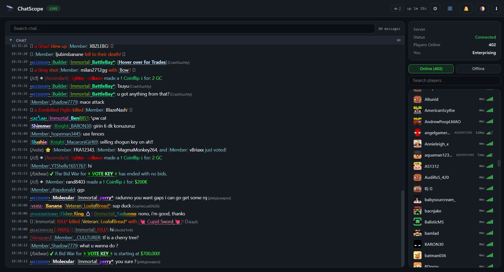
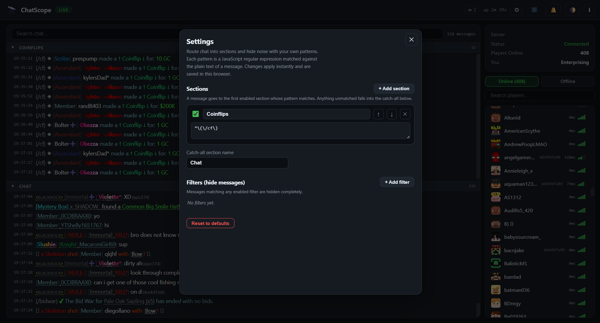

<p align="center">
	
</p>

<h1 align="center">ChatScope</h1>

A client-side **Fabric mod for Minecraft 1.21.11** that mirrors your in-game chat, server info, and player list to a live web dashboard — with **fully configurable sections and filters**.

While Minecraft is running, open **<http://localhost:25534>** in any browser and you get a real-time view of your chat that you can organise however you like.



## Features

- **Live chat**, updated instantly over a WebSocket (no refreshing). Minecraft colours, bold/italic, and hover tooltips (item stats, entity info) are preserved.
- **Configurable sections** — split chat into as many named sections as you want, each matched by your own regular expressions. Anything unmatched lands in a catch-all section. Sections are collapsible and resizable.
- **Filters** — hide noisy messages entirely with your own regex patterns.
- **Live settings panel** — add, rename, reorder, enable/disable sections and filters right in the browser. Changes apply instantly and are saved locally. Invalid regexes are flagged and simply ignored.
- **Player list** like the in-game tab list: skins/heads, ping bars, game mode, and UUID on hover. Search it, and switch between **Online** and **Offline** (everyone seen in the chat log).
- **Player profiles** — click a player for an interactive 3D view of their skin plus their full logged message history, with search and pagination.
- **Per-server chat log** stored in a local SQLite database, split into a table per server so history never mixes between servers.
- **Network access with an optional password** — the dashboard listens on all interfaces, so it's easy to port-forward. Set a password in the mod settings to protect it (empty = open).
- **Quality of life**: dark/light theme, accessibility mode (whitens everything after a player's rank), mention sound, live viewer count, connection uptime, chat search, and export to a text file.
- No external frontend frameworks — just HTML, CSS, and JavaScript.

## Installing

**Requirements**

| | Version |
| --- | --- |
| Minecraft | 1.21.11 |
| Fabric Loader | 0.16.14 or newer |
| **Fabric API** | **0.140.0+1.21.11** (or newer for 1.21.11) |
| Java | 21+ |
| [Mod Menu](https://modrinth.com/mod/modmenu) | optional — only for the in-game settings button |

[Cloth Config](https://modrinth.com/mod/cloth-config) is **bundled** in the jar, so you don't need to install it separately.

**Steps**

1. Install [Fabric Loader](https://fabricmc.net/use/) for Minecraft **1.21.11**.
2. Put the ChatScope jar **and** [Fabric API](https://modrinth.com/mod/fabric-api) (`0.140.0+1.21.11` or newer) in your `mods` folder. Add [Mod Menu](https://modrinth.com/mod/modmenu) too if you want the in-game settings button.
3. Launch Minecraft. The log prints `ChatScope running on http://localhost:25534`.
4. Open <http://localhost:25534> in a browser.

## Configuring sections & filters

Click the **⚙ settings** button in the top bar.



- **Sections** — each has a name, an on/off toggle, and one or more regex patterns (one per line). A message goes to the **first enabled section whose pattern matches**; the order matters, so use the ↑ / ↓ buttons to prioritise. Whatever matches nothing falls into the catch-all section (rename it at the bottom).
- **Filters** — each is a single regex. A message matching **any enabled filter** is hidden completely.

Patterns are standard JavaScript regular expressions, matched against the plain (colour-code-stripped) text of each message. Examples:

| Goal | Pattern |
| --- | --- |
| A "Staff" section for staff chat | `^\[Staff\]` or `\[SC\]` |
| Route deaths together | `was slain\|was shot\|drowned\|fell` |
| Hide a shop spam prefix | `^SHOP »` |
| Hide anything indented (centered banners) | `^ {6,}\S` |

Your configuration lives in the browser (localStorage), so each viewer can customise their own layout.

## Network access & password

The dashboard listens on **all network interfaces** (`0.0.0.0`), so it's reachable at `http://<your-computer-ip>:25534` from other devices on your network and can be **port-forwarded** directly — no tunnel required.

Because it can be exposed, ChatScope has an optional **password**:

- Open the mod's settings in-game via [Mod Menu](https://modrinth.com/mod/modmenu) (**Mods → ChatScope → Settings**), or edit `config/chatscope.json` by hand.
- Set a password to require it before the dashboard loads. Leave it **empty for open access** (the default). Changes take effect immediately — no restart needed.

[Cloth Config](https://modrinth.com/mod/cloth-config) is bundled, so no extra install is needed; Mod Menu is only required for the in-game settings button (the password still works via the config file without it).

> Only expose the dashboard to people you trust — anyone who can reach it (and knows the password, if set) can read the chat log and player history.

## Building

Requirements: **JDK 21**. Gradle is provided by the wrapper.

```bash
./gradlew build          # Windows: gradlew.bat build
```

The mod jar is written to `build/libs/chatscope-<version>.jar` (use the one *without* `-sources`).

## Notes

- Player heads and skins load from [Crafatar](https://crafatar.com) by UUID, falling back to [mc-heads.net](https://mc-heads.net) by name for offline-mode servers.
- The chat log database lives at `<game dir>/chatscope/chat.db` and can be opened with any SQLite browser.
- Runs entirely client-side; the embedded web server listens on all interfaces (`0.0.0.0`).

## Project layout

```
src/main/java/com/chatscope/
├── ChatScope.java           entry point, wiring, web server lifecycle
├── config/                  mod settings (password) + Mod Menu screen
├── chat/                    chat event listener + bounded history buffer
├── players/                 tab list polling
├── server/                  connection tracking + shared dashboard state
├── web/                     embedded HTTP server (NanoHTTPD)
├── websocket/               WebSocket sockets + broadcast thread
├── db/                      per-server SQLite chat log
├── model/                   immutable JSON-serializable records
└── util/                    Text→segments conversion, JSON helpers
src/main/resources/web/      index.html, style.css, app.js
```

## License

MIT — see [LICENSE](LICENSE).
